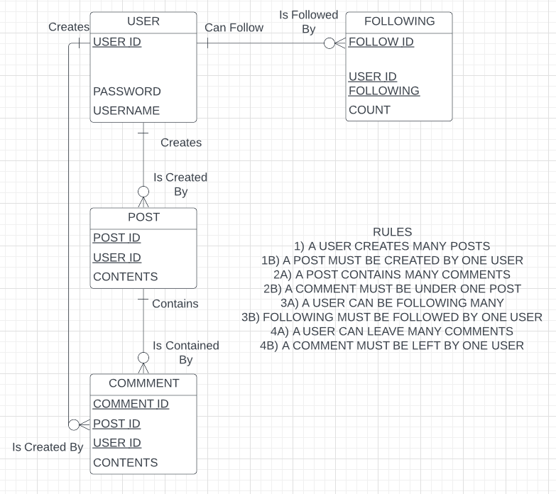

# Social Media app
## Author  
Kyle Harkin  
## Purpose  
This app is the final project for CPS593 Web and Database Programming for the Spring 2022 semester at SUNY New Paltz, developed using both class notes/examples and original code  

## Description of App  
This app is an unfinished simple social media website  
## Capabilities of Current App  
The app has the following current capabilities:  
* Users can register, login, edit, and delete their account  
* The app utilizes local storage to remember who is logged in and adjust the navigation bar accordingly  
* Has windows for the user to add a post, see posts, delete posts, add comments, add followers  
* Node server running to track and update website  
* mySQL database creation with tables for respective entities  
* Adds null entries into the mySQL database for posts, comments, and follows  
## Future App Implementations  
Further work can be done on the app via the following:  
* Comments should be related to posts as well as users! (forgot to implement this)
* Adding actual post, comment, and follower data to be posted to database, not just current null values  
* Having it so a user can search for another's username and add follower  
* Have a follower/following counter working  
* Ability to see and delete posts and comments from database  
* User password should be hidden on the database -> for security 
## Bugs and Issues
The current version has the following:
* When attempting to edit a freshly registered user, the edit profile window does not display pertinent information -> displays undefined  
* To resolve fresh user edit, logout and login again -> edit now displays user info  
* mySQL database entries for posts, comments, and followers are null/undefined -> entries will add but without information  
## Languages and Technologies  
### Front End  
* HTML
* Javascript
* JSON
* CSS
* Local Storage
### Back End  
* HTTP
* Javascript
* JSON
* Node Server: Express, Nodemon
* mySQL
## Entity Relationship Diagram  
  
### Description of Entities:  
1. User -> this is the user profile for the site -> contains a unique ID number, username and password
2. Post -> this is an entity that a single user can create many of -> contains a unique ID number, contents, and is related to the userID
3. Comment -> this is an entity that a single user can create many of 

## How to Use  
1. Download all files from the github 
2. Download nad install Node.js and mySQL 
3. Run the following commands: npm init, npm install express, npm install nodemon, npm install --save-dev 
4. Change the package.json under "scripts" -> add "dev:" "nodemon index.js" -> (above "test:")
5. Run mySQL database -> create my_db
6. Run the command: npm run dev 
7. Go to any website HTML file -> start at Login or Register
## Screenshots  
Below are screenshots from the website in operation:  

Below are screenshots from the mySQL database attached to the website:  

